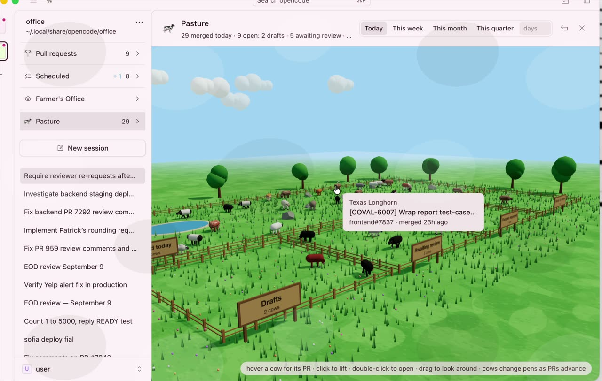

# 🎞️ THE FEATURE REEL

every trick the cow knows, with film where we have it. each feature gets its own
page once it has footage; until then it gets a paragraph and a promise.

links on this page are public. hand them out.

| feature | what it does | film |
| --- | --- | --- |
| [🐄 the pasture](pasture.md) | every one of your pull requests is a cow in a pen. merged cows out back. the hand of god moves them when a PR changes stage. | ▶️ [17 s](https://github.com/callumreid/cow_code/blob/dev/docs/features/pasture/pasture-pens.mp4) |
| [🚦 pull requests, ranked](#-pull-requests-ranked) | every open PR you wrote, one badge each, worst thing first. three switches per PR: keep updated, auto-fix review comments, merge when ready. | 📹 soon |
| [🧑‍🌾 the farmer's office](#-the-farmers-office) | tell the farmer what to do. the farmer sends cows out to do it in their own worktrees and reports back. | 📹 soon |
| [🗓️ scheduled](#️-scheduled) | everything the barn runs on a clock, with the last run, the next run, and a run-now button. | 📹 soon |
| [📱 the phone](#-the-phone) | scan a square, the whole barn is on your phone, live sessions included. | 🎬 in the [hype film](../../artifacts/hype-video/README.md) |
| [🎨 the wardrobe](#-the-wardrobe) | eighteen cow-breed themes, light and dark pelts. | 📹 soon |
| [🏠 the pen](#-the-pen) | the remodeled sidebar: always out, pinned threads, inline rename. | 📹 soon |
| [🏆 the big dog census](#-the-big-dog-census) | counts every big dog, yours and the agent's. | 📹 soon |
| [🔊 tab](#-tab) | press tab. it mooos. | 🎬 in the [hype film](../../artifacts/hype-video/README.md) |

---

## 🐄 the pasture

a green field with five fenced pens. drafts, awaiting review, changes requested and
ready to merge across the front; the merged herd out back with the pond. every one
of your pull requests is a cow (thirty breeds, the breed is decided by the PR, so
the same PR is always the same cow). cows wander and graze. hover one for its PR,
click to lift it with its legs dangling and read the details, double-click to open
it on github. there is a moo button.

when a PR changes stage the hand of god comes down, picks the cow up and carries it
to its new pen. new PRs are lowered in from the sky. closed ones are taken away.

👉 **[full page with the film →](pasture.md)**

## 🚦 pull requests, ranked

a pull requests section in the sidebar lists every open PR you wrote, grouped by
repo, oldest first. each gets one badge, whichever is worst: draft, changes
requested, checks failing, unresolved, awaiting review, or ready, with the reason
underneath. every PR has three switches, stored as github labels so every machine
agrees: **keep updated** (rebase or update when it falls behind), **auto-fix review
comments** (an agent answers the bots and the humans), and **merge when ready** (off
by default; when CI is green, a human has approved and nothing is unresolved, it
merges or joins the merge queue, and if the queue bounces it, it works out why, fixes
it, and goes back in).

📹 no film yet.

## 🧑‍🌾 the farmer's office

a room with a farmer in it. tell the farmer what you want done, in text or out loud,
and the farmer dispatches cows: each one a real session in its own git worktree,
listed with the rest of your threads with the usual cow and guy fieri indicators.
the farmer only pipes up when something starts, when something needs you
(a permission, a question, a login) and when something went wrong. no progress chatter.

📹 no film yet.

## 🗓️ scheduled

everything the barn runs on a clock: the PR review sweep, the review-comment fixer,
keep-updated, merge-when-ready, the health checks. each shows its schedule, its
window, the last run and how it went, and a run-now button. so you can see the thing
happen instead of hoping it did.

📹 no film yet.

## 📱 the phone

type `/qr` in the terminal or hit ⌘K → connect phone in the desktop app, point your
camera at the square, and your real sessions are on your phone. not read-only:
send into a running session and watch it keep going.

🎬 the phone has its own segment in the [hype film](../../artifacts/hype-video/README.md).

## 🎨 the wardrobe

one cow, eighteen coats. holstein, jersey, guernsey, brahman, belted galloway, angus,
kobe, woolly scottish coo, texas longhorn, oryx, hereford, charolais, ayrshire, yak,
bison, strawberry cow, aurochs, water buffalo. each with a light pelt and a dark pelt,
in the theme picker of both the TUI and the desktop app.

📹 no film yet.

## 🏠 the pen

the session sidebar is always out, drags wider and remembers. pin threads and they
float to the top. double-click a name to rename it inline. settings and help are one
account row with your name on it. the DEV badge is a cow.

📹 no film yet.

## 🏆 the big dog census

settings counts every time you called your agent some version of "big dog" and every
time the agent announced big dog mode, across every session on your server. two
numbers. total honesty.

📹 no film yet.

## 🔊 tab

press <kbd>Tab</kbd>. it mooos. out loud. a real mooo. that is the whole job.

🎬 harvested for the [hype film](../../artifacts/hype-video/README.md).

---

### adding a film

drop a `.mov` or `.mp4` in `docs/features/<feature>/`, keep it under about 10 MB
(1280 wide, 30 fps, h264 is plenty), add a poster frame, and link it from the table
above and the feature's section. github plays `.mp4` files straight from the file
page, and `https://cdn.jsdelivr.net/gh/callumreid/cow_code@dev/<path>` serves the
same file as a plain public URL that plays in any browser.
