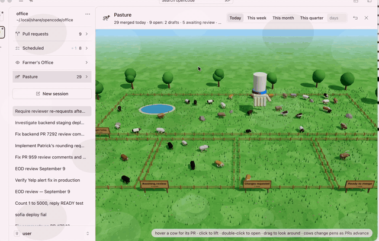

# 🐄 THE PASTURE

### ▶️ [WATCH THE FILM WITH SOUND](https://github.com/callumreid/cow_code/blob/dev/docs/features/pasture/pasture-pens.mp4) ▶️

*17 seconds. a real mooo. the hand of god makes an appearance.*

**share it:** the film plays right on github at
<https://github.com/callumreid/cow_code/blob/dev/docs/features/pasture/pasture-pens.mp4>,
or as a plain video URL at
<https://cdn.jsdelivr.net/gh/callumreid/cow_code@dev/docs/features/pasture/pasture-pens.mp4>.
this page is <https://github.com/callumreid/cow_code/blob/dev/docs/features/pasture.md>.

## what you are looking at

a green field under the farmer's office in the sidebar. five fenced pens with
wooden signs and live headcounts:

| pen | who grazes there |
| --- | --- |
| **drafts** | your draft pull requests |
| **awaiting review** | open, not a draft, nobody has approved yet (also where "checks not green" and "unresolved comments" wait) |
| **changes requested** | a reviewer asked for changes, or you asked them to look again |
| **ready to merge** | approved, green, nothing unresolved, or already in the merge queue |
| **merged** | out back with the pond. today by default; the header switches it to this week, this month, this quarter, or any number of days |

only your own pull requests. never everyone's.

## the cows

one cow per pull request. thirty breeds — hereford, belted galloway, brahman,
angus, highland, holstein, jersey, texas longhorn, chianina, dexter and twenty
more — with coats painted on the fly. the breed is decided by the PR itself, so
the same PR is always the same cow, and it keeps its markings as it moves from
pen to pen. they wander, graze, flick their tails and stay out of the pond.

- **hover** a cow: its PR, repo and number, and what is holding it up.
- **click** a cow: it is lifted into the air, legs dangling, and the inspector
  opens with the PR, its stage, review and CI state, when it was opened and
  updated, and for merged cows who merged it, when, and the diff size.
- **double-click**: opens the PR on github.
- **moo**: a button on the selected cow. it mooos. pitched by breed size, so a
  dexter squeaks and a chianina rumbles.
- **drag** to look around, scroll to zoom. escape puts the cow down.

## the hand of god

when a pull request changes stage, the hand of god descends from the sky, curls its
fingers round the cow, lifts it, carries it in an arc to its new pen and sets it
down. a brand-new PR is lowered in from above. a closed PR is picked up and taken
away. a merged one is carried out back.

a cow whose PR just vanished from the open list waits in its pen for a few minutes
so github's merged search can catch up; that way a merge reads as a move to the back
pen, not a disappearance. if a whole herd changes at once (you switched the
timeframe), the field just updates. the hand is for moments, not migrations.

## where it comes from

- the open pens are fed by the same github data as the pull requests panel, re-read
  every minute while the field is open.
- the merged pen is a github search for your merged PRs in the timeframe, refreshed
  every couple of minutes.
- everything is drawn with three.js from primitives and canvas textures. there are
  no model files to ship.

← back to [the feature reel](README.md)
